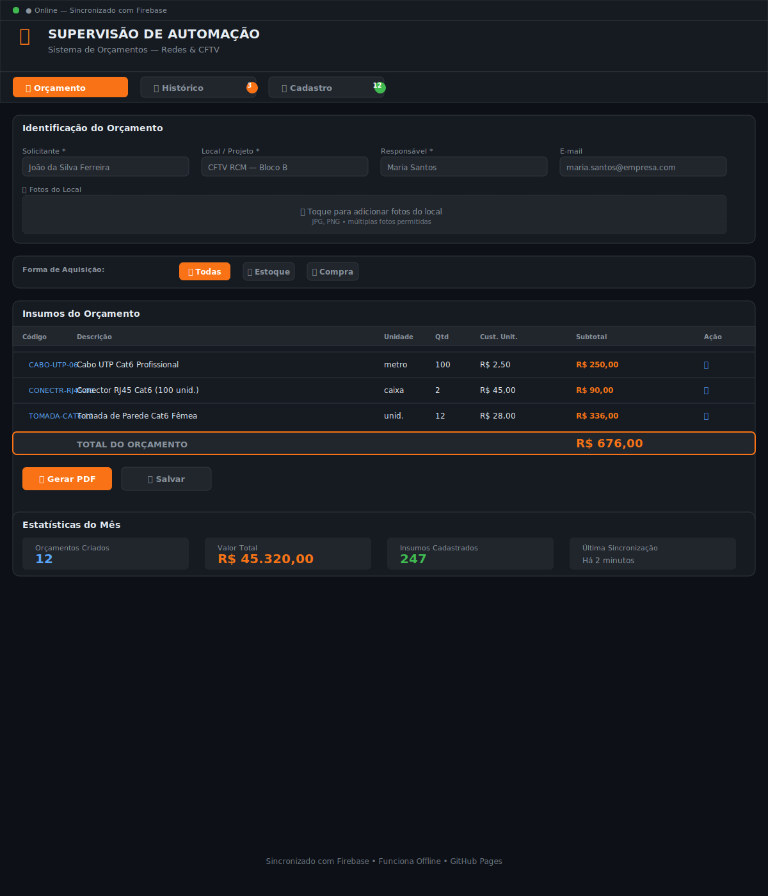

# 📡 Sistema de Orçamentos — Redes & CFTV

**Aplicação web responsiva para gestão de orçamentos de infraestrutura de redes e CFTV com sincronização em tempo real via Firebase.**

---

## 🎯 Visão Geral



Um sistema completo de orçamentação para projetos de redes e CFTV, com:

- ✅ **Sincronização em Tempo Real** — Múltiplos usuários editando simultâneamente
- ✅ **Offline-First** — Funciona mesmo sem internet (PWA)
- ✅ **Firebase Realtime Database** — Dados na nuvem de forma segura
- ✅ **Geração de PDF** — Exportar orçamentos em PDF profissional
- ✅ **Fotos do Local** — Documentação visual de projetos
- ✅ **Histórico Completo** — Rastreamento de todas as versões de orçamentos
- ✅ **Cadastro de Insumos** — Banco de dados de materiais com múltiplas formas de aquisição
- ✅ **Design Responsivo** — Desktop, tablet e mobile

---

## 🚀 Como Usar

### Acesso Online
Acesse o aplicativo diretamente em seu navegador:
```
https://seu-github-username.github.io/repo-name/orcamento_redes.html
```

### Instalação Local (PWA)
1. Abra o aplicativo no navegador
2. Clique em "Instalar" (Chrome, Edge, Firefox) ou adicione à tela inicial (iOS/Android)
3. O app funciona totalmente offline

### Configuração do Firebase

Para usar a sincronização em tempo real, configure seu Firebase:

1. Acesse [Firebase Console](https://console.firebase.google.com)
2. Crie um novo projeto
3. Ative Firestore Database
4. Copie a configuração do projeto
5. Edite `orcamento_redes.html` e substitua:

```javascript
const firebaseConfig = {
  apiKey:            "SUA_API_KEY",
  authDomain:        "seu-projeto.firebaseapp.com",
  projectId:         "seu-projeto",
  storageBucket:     "seu-projeto.appspot.com",
  messagingSenderId: "000000000000",
  appId:             "1:000000000000:web:0000000000000000"
};
```

---

## 📋 Funcionalidades Principais

### 1️⃣ **Aba Orçamento**
- Criar novo orçamento com identificação do solicitante
- Especificar local/projeto e responsável
- Adicionar fotos do local (múltiplas imagens)
- Selecionar forma de aquisição (Estoque/Compra)
- Adicionar insumos à tabela com quantidade
- Cálculo automático de subtotais e total
- Exportar para PDF

### 2️⃣ **Aba Histórico**
- Visualizar todos os orçamentos já criados
- Ver data, autor, local e valor total
- Restaurar versão anterior com um clique
- Deletar orçamentos antigos
- Ordenação e filtros avançados

### 3️⃣ **Aba Cadastro**
- Gerenciar banco de insumos (materiais)
- Adicionar código, descrição, unidade, custo
- Definir origem (Estoque ou Compra)
- Adicionar observações
- Editar e deletar insumos existentes

---

## 🎨 Interface

### Design System
- **Tema**: Dark mode moderno (GitHub-inspired)
- **Paleta de Cores**:
  - 🟠 Accent: `#f97316`
  - 🟢 Success: `#3fb950`
  - 🔴 Error: `#f85149`
  - 🔵 Info: `#58a6ff`

### Responsividade
- **Desktop** (1200px+): Layout 4 colunas
- **Tablet** (768px+): Layout 2 colunas
- **Mobile** (<768px): Layout 1 coluna

### Status de Sincronização
Indicador visual em tempo real:
- 🟢 **Online** — Conectado e sincronizando
- 🟡 **Sincronizando** — Salvando alterações
- 🔴 **Offline** — Sem conexão (dados em cache local)

---

## 📊 Estrutura de Dados

### Orçamento (Budget)
```json
{
  "id": "orca_2024_001",
  "solicitante": "João Silva",
  "local": "CFTV RCM — Bloco B",
  "responsavel": "Maria Santos",
  "email": "maria@empresa.com",
  "dataCreate": "2024-04-19T10:30:00Z",
  "versao": 1,
  "itens": [
    {
      "matId": "mat_001",
      "descricao": "Cabo UTP Cat6",
      "unidade": "m",
      "qtd": 100,
      "custUnit": 2.50,
      "subtotal": 250.00,
      "aquisicao": "COMPRA"
    }
  ],
  "fotos": ["data:image/png;base64,..."],
  "total": 5000.00,
  "status": "ATIVA"
}
```

### Material (Insumo)
```json
{
  "id": "mat_001",
  "codigo": "CABO-UTP-06",
  "descricao": "Cabo UTP Cat6 Profissional",
  "unidade": "m",
  "custo": 2.50,
  "aquisicao": "COMPRA",
  "obs": "Marca certificada NBR"
}
```

---

## 🔐 Segurança

### Autenticação
- Sem login obrigatório (uso pessoal/equipe confiável)
- Para ambientes corporativos, configure autenticação Firebase

### Proteção de Dados
- ✅ HTTPS por padrão (GitHub Pages)
- ✅ Dados no Firebase com regras de segurança
- ✅ Nenhum dado sensível em localStorage (apenas cache)

### Recomendações de Produção
```
rules_version = '2';
service cloud.firestore {
  match /databases/{database}/documents {
    match /budgets/{document=**} {
      allow read, write: if request.auth != null;
    }
    match /materials/{document=**} {
      allow read, write: if request.auth != null;
    }
  }
}
```

---

## 📱 Modo PWA (Aplicativo Instalável)

O aplicativo é um **Progressive Web App** totalmente funcional:

### Instalação
1. **Chrome/Edge**: Menu → Instalar aplicativo
2. **Firefox**: Menu → Instalar como aplicativo
3. **iOS**: Compartilhar → Adicionar à tela inicial
4. **Android**: Menu → Instalar app

### Funcionamento Offline
- Usa Service Worker para cache inteligente
- Modo offline sincroniza automaticamente ao reconectar
- Dados locais nunca são perdidos

---

## 📥 Exportação de PDF

### Recursos
- Formatação profissional com logotipo
- Página de rosto com dados do orçamento
- Tabela detalhada de insumos
- Miniaturas das fotos do local
- Assinatura/aprovação
- Versão impressa otimizada

---

## 🛠️ Tecnologias

| Tech | Uso |
|------|-----|
| **HTML5** | Estrutura semântica |
| **CSS3** | Design responsivo, animações |
| **JavaScript (Vanilla)** | Lógica da aplicação |
| **Firebase Realtime DB** | Sincronização de dados |
| **jsPDF** | Geração de PDF |
| **html2canvas** | Captura de screenshots |
| **Service Worker** | PWA offline |
| **GitHub Pages** | Hospedagem grátis |

---

## 📈 Roadmap

- [ ] Autenticação Firebase (Multi-user)
- [ ] Templates de orçamento personalizáveis
- [ ] Integração com WhatsApp/Email
- [ ] Análise de histórico (gráficos)
- [ ] Sincronização com Google Drive
- [ ] Modo dark/light customizável
- [ ] Suporte a múltiplos idiomas

---

## 🐛 Troubleshooting

### "Conectando ao Firebase..."
- Verifique sua conexão com internet
- Verifique a configuração do Firebase
- Confira se o arquivo Firebase SDK está acessível

### Dados não sincronizam
- Abra DevTools (F12) → Console
- Verifique se há erros de Firebase
- Confirme as regras de segurança do Firestore

### PWA não instala
- Só funciona em HTTPS (GitHub Pages já é HTTPS)
- Chrome/Edge/Firefox/Android suportados
- iOS requer Safari iOS 15+

---

## 📞 Suporte

Para dúvidas ou sugestões:
- 📧 Email: seu-email@empresa.com
- 💬 Issues no GitHub
- 📱 WhatsApp: seu-telefone

---

## 📄 Licença

Este projeto é fornecido como-está para uso pessoal e empresarial interno.

---

**Desenvolvido com ❤️ para supervisão de automação, instrumentação e redes**

*Última atualização: Abril 2024*
